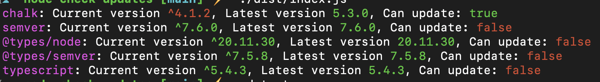

# node-check-updates

Easily update all of your Node.js dependencies to the latest compatible versions.

## Description

`node-check-updates` is a command-line tool inspired by `npm-check-updates`, but with a key difference. It checks all your Node.js project dependencies and lets you know which ones are out of date. However, unlike `npm-check-updates`, `node-check-updates` ensures that the updated versions are compatible with your project. It color-codes the output for easy reading: current versions are shown in red if an update is available, and the latest compatible versions are shown in green. If an update is not available, both the current and latest versions are shown in green.

## Usage

You can run `node-check-updates` directly with `npx` without installing it:

```bash
npx node-check-updates
```

See it in action!


